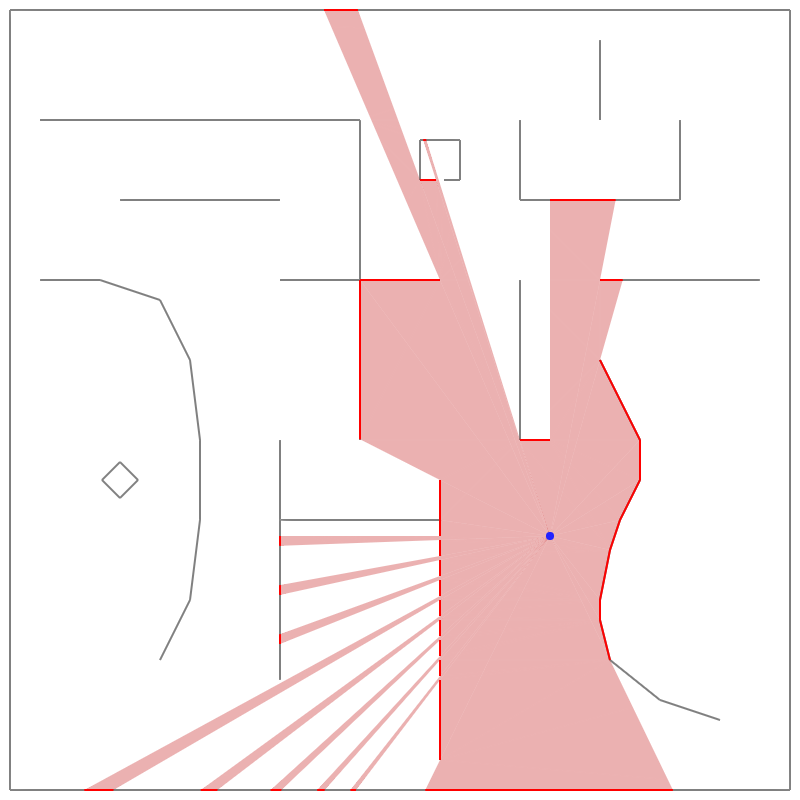
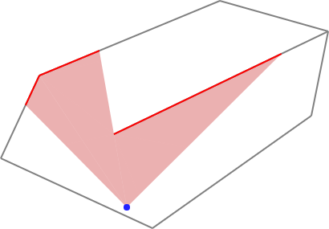

TriVis
======

Compute visibility polygons by Triangular Expansion.

Example
-------

	// Points to be triangulated
	const points = [[53,98],[5,201],[194,288],[280,195],[392,148],[413,43],[278,5],[169,71],[146,171]],
		// Edges to be constrained
		edges = [[5, 8]],
		// Triangulate
		del = Delaunator.from(points),
		// Constrain the triangulation
		con = new Constrainautor(del);
	con.constrainAll(edges);
	
	// Query point
	const qx = 162, qy = 262,
		// Obstruction callback: use constrained edges as obstructions
		obstructs = (edg) => con.isConstrained(edg),
		// Left & right end-points of the initial viewing cone (optional)
		ilx = 45, ily = 144, irx = 280, iry = 145,
		// Compute visibility polygon
		poly = triangularExpansion(del, qx, qy, obstructs, ilx, ily, irx, iry);
	
	for(const [lx, ly, rx, ry] of poly){
		drawTriangle(lx, ly, qx, qy, rx, ry);
	}

Install
-------

Install from NPM:

	npm install @kninnug/trivis
	
Use in Node.js:

	const triangularExpansion = require('@kninnug/trivis');
	
or as an ECMAScript/ES6 module:

	import triangularExpansion from '@kninnug/trivis';

or in the browser:

	

or minified:

	

The TriVis library does not depend on Delaunator itself, but the input is
expected to be in the format that Delaunator outputs. The ES module variant
(`TriVis.mjs`) depends on [robust-predicates](https://www.npmjs.com/package/robust-predicates)
and [containing-triangle](https://www.npmjs.com/package/@kninnug/containing-triangle),
but the browser and minified versions (`TriVis.js` and `TriVis.min.js`) come
with these dependencies compiled in, and can be used standalone.

Usage
-----

### poly = triangularExpansion(del, qx, qy, obstructs, ilx = NaN, ily = NaN, irx = NaN, iry = NaN)

Parameters:

- `del`: The triangulation in the format that Delaunator outputs.
- `qx`, `qy`: The coordinates of the query point.
- `obstructs`: A callback that receives an edge id of the triangulation and must
  indicate whether it obstructs the view. Edges on the hull of the triangulation
  are always considered to be obstructing.
- `ilx`, `ily`, `irx`, `iry`: If given, i.e. not `NaN`, the coordinates of the
  left and right points restricting the viewing cone. The angles between these
  points and the query point should not be greater than 180°. If these arguments
  are not given, the visibility polygon is computed in all directions.

Return value:

An array of 4-element arrays, `[lx, ly, rx, ry]` with the coordinates of the
left- and right-hand side end-points of the segments that make up the visibility
polygon. Each triplet `(lx, ly) (qx, qy) (rx, ry)` forms a counter-clockwise
triangle that is entirely visible from the query point. The segments are also
ordered counter-clockwise around `(qx, qy)`.

Attributions
------------

- The Triangular Expansion algorithm is adapted from [Efficient Computation of
  Visibility Polygons](https://arxiv.org/abs/1403.3905), March 18, 2014,
  Francisc Bungiu, Michael Hemmer, John Hershberger, Kan Huang, Alexander Kröller.
- Uses Vladimir Agafonkin's [robust-predicates](https://github.com/mourner/robust-predicates) port
  of Jonathan Shewchuk's [Adaptive Precision Floating-Point Arithmetic and Fast Robust Predicates
  for Computational Geometry](http://www.cs.cmu.edu/~quake/robust.html).
- Ray-segment intersection computation adapted from Nicky Case's
  [Sight & Light tutorial](https://ncase.me/sight-and-light/).
- The example image and initial idea for this library were inspired by Amit
  Patel's article on [2D visibility](https://www.redblobgames.com/articles/visibility/).
